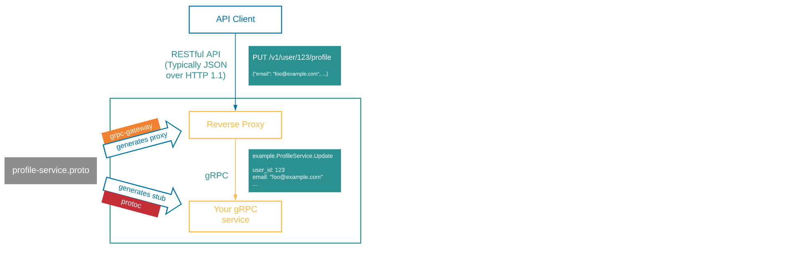

# GRPC, Meeting #3

## Notes from the meeting

* ~~What gRPC is and why/how it is used~~ // Covered: meeting #1

* Ecosystem/Tools/Implementation/Standards

  * ~~gRPC communication with protobuf encoding~~ // Covered: meeting #1

  * ~~Creating protobuf message and service definitions~~ // Covered: meeting #1

  * ~~Updating, versioning and maintaining backwards compatibility~~ // Covered: meeting #1

  * ~~Compiling the protobuf into client/server stubs~~ // Covered: meeting #1

  * ~~gRPC server reflection~~ // Covered: meeting #2

  * ~~Tools~~ // Covered: meeting #2

  * ~~Unary vs streaming gRPC~~ // Covered: meeting #2

  * ~~[Interceptors](https://blog.dsb.dev/posts/creating-grpc-interceptors-in-go/)~~ // Covered: meeting #2

  * ~~Middleware~~ // Covered: meeting #2

  * [gRPC-Gateway](https://grpc-ecosystem.github.io/grpc-gateway/docs/tutorials/introduction/)
    * Reads a gRPC service definition and generates a reverse-proxy server which translates a RESTful JSON API into gRPC
    
    * Why?
      * gRPC-Gateway [background](https://grpc-ecosystem.github.io/grpc-gateway/docs/overview/background/): "gRPC is great... However, you might still want to provide a traditional RESTful API as well."
      * example from etcd: [Why gRPC gateway](https://etcd.io/docs/v3.4/dev-guide/api_grpc_gateway/): "For languages with no gRPC support, etcd provides a JSON gRPC gateway. This gateway serves a RESTful proxy that translates HTTP/JSON requests into gRPC messages."
    * [Adding gRPC-Gateway annotations to an existing proto file](https://grpc-ecosystem.github.io/grpc-gateway/docs/tutorials/adding_annotations/)

    * **Exercise 6**: Add gRPC-Gateway to the proto file for your gRPC server from Exercise 3. Recompile using `buf`. Then implement your server as a REST server using gRPC-Gateway running on localhost:8080. Test a REST request using `curl`, a browser, or Postman.

  * Demo: Implementing streaming, vs simple/unary, gRPC endpoints (Luke K.)
    * See demo [README](https://github.com/itt-learning-groups/grpc_streaming_demo/blob/main/README.md) and [code](https://github.com/itt-learning-groups/grpc_streaming_demo).

    * **Exercise 7**: ...

* Resources, links
  
  * [Awesome gRPC](https://github.com/grpc-ecosystem/awesome-grpc): *"A curated list of useful resources for gRPC"*
  * [A Guide to gRPC and Interceptors](https://edgehog.blog/a-guide-to-grpc-and-interceptors-265c306d3773) (blog article also referenced above in Exercise 2)
  * [gRPC Go: Beyond the basics](https://blog.gopheracademy.com/advent-2017/go-grpc-beyond-basics/), from Gopher Academy Blog: *"The purpose of this blog is to be a guideline for where to find the resources and leverage these libraries and features to make the most of the gRPC ecosystem after you understand the basics of gRPC"*

* Kount implementation and standards/patterns // Todo: approx. meeting #4

* Common techniques & tasks, "gotchas", tips & tricks // Todo: approx. meeting #4-5

* ~~{Case Studie(s)}~~ // Skip for this unit

* {"Class" exercise(s)} // Todo: approx. meeting #5-6
